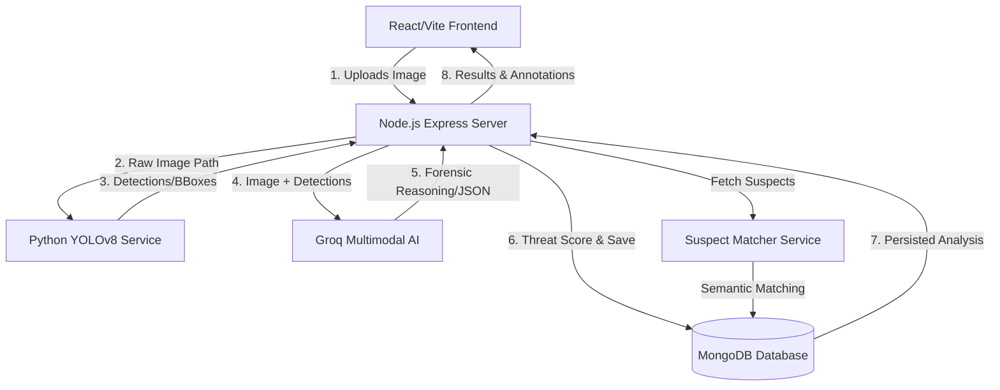

# CrimeLens AI

CrimeLens is a comprehensive, AI-powered forensic visual analysis and crime intelligence platform. It processes scene imagery through advanced object detection and multimodal large language models to construct accurate, real-time forensic interpretations. The platform features an intelligence dashboard, dynamic geolocated threat mapping, and an automated case management engine.

## 🏗️ System Architecture

CrimeLens utilizes a multi-layered microservice architecture designed for high-performance visual reasoning and data persistence.



### Component Breakdown
- **Client (Frontend)**: A React-based dashboard with Leaflet for mapping, Recharts for analytics, and JSPDF for generating forensic reports.
- **Backend (Node.js)**: Orchestrates the analysis pipeline, manages JWT authentication, and performs suspect profiling using a composite scoring algorithm.
- **YOLOv8 Service (Python)**: A Flask microservice running a pre-trained Ultralytics YOLOv8 engine for rapid object detection and coordinate mapping.
- **AI Inference Engine**: Integrates with Groq's multimodal vision pipeline (`llama-4-scout`) to perform high-level forensic reasoning, anomaly detection, and hallucination correction for YOLO detections.

## ✨ Core Features

- **🔴 Live Forensic Monitoring**: Real-time surveillance frame analysis with automated threat alerts and anomaly detection for critical incidents (Assault, Theft, Weapons).
- **🕵️ Suspect Profiler**: A sophisticated matching engine that cross-references forensic evidence against a criminal database using MO (Modus Operandi) patterns, weapon association, and geospatial proximity.
- **🗺️ Geospatial Intelligence**: Dynamic interactivity with incident heatmaps using `React-Leaflet`. Tracks and clusters crime patterns within a proximity grid relative to the current location.
- **📑 Forensic Case Management**: End-to-end case tracking, allowing investigators to group multiple analyses into formal "Cases" with status management (Open, Investigating, Resolved).
- **📊 Automated PDF Reporting**: Generates professional, court-ready forensic reports including annotated imagery, AI reasoning, suspect match lists, and threat assessments.
- **⚡ Threat Scoring Algorithm**: Weighs identified objects, forensic markers, and AI-determined confidence to assign deterministic priority levels (Critical to Minimal).

## 🛠️ Technology Stack

- **Client**: React.js, Vite, Axios, React-Leaflet, Recharts, JSPDF, Vanilla CSS.
- **Server**: Node.js, Express.js, Mongoose, Multer, JSONWebToken.
- **Vision Microservice**: Python 3, Flask, Ultralytics (YOLOv8n), PyTorch.
- **AI Inference API**: Groq Cloud SDK (running `meta-llama/llama-4-scout` vision model).
- **Database**: MongoDB (utilizing 2dsphere indexing for geospatial queries).

## 🚀 Installation and Execution

The platform is partitioned into three distinct operational layers.

### 1. The YOLOv8 Microservice

Navigate to the `yolo-service` directory, install dependencies, and start the Flask instance.

```bash
cd yolo-service
pip install -r requirements.txt
python app.py
```
*The service will bind to `http://localhost:5001`. On first execution, the Ultralytics engine will download the pre-trained weights.*

### 2. The Backend Server

Navigate to the `server` directory and install the Node packages.

```bash
cd server
npm install
```

Configure your `.env` file with the following variables:

```env
PORT=5000
MONGODB_URI=mongodb://localhost:27017/crimelens
JWT_SECRET=your_jwt_secret_key
GROQ_API_KEY=your_groq_api_key
GROQ_MODEL=meta-llama/llama-4-scout-17b-16e-instruct
YOLO_SERVICE_URL=http://localhost:5001
```

Seed the database with initial criminal records and start the server:

```bash
npm run seed
npm run dev
```

### 3. The React Client

Navigate to the `client` directory.

```bash
cd client
npm install
npm run dev
```
*The application interface will be served at `http://localhost:5173`.*

## 📄 License

This project is designed for forensic visual scene-reasoning and integrated spatial intelligence research.
