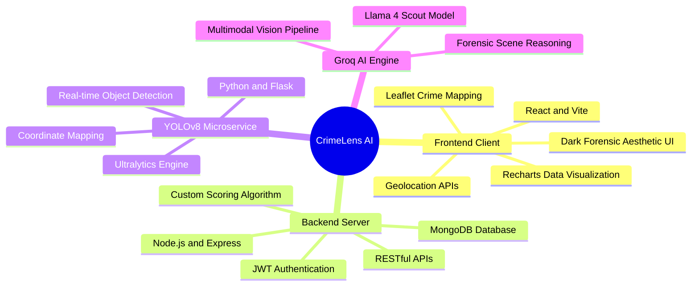

# CrimeLens AI

CrimeLens is a comprehensive, AI-powered forensic visual analysis and crime intelligence platform. It processes scene imagery through advanced object detection and multimodal large language models to construct accurate, real-time forensic interpretations. The platform features an intelligence dashboard, dynamic geolocated threat mapping, and an automated case management engine.

## System Architecture



## Features

- **Automated Forensic Analysis**: Processes images via YOLOv8 and Groq's Llama 4 Scout to generate natural-language forensic scene overviews, anomaly detections, and threat assessments.
- **Dynamic Geospatial Mapping**: Leverages the HTML5 Geolocation API and React-Leaflet to dynamically project clustered incident reports within a local proximity grid relative to the investigator's live location.
- **Threat Scoring Algorithm**: A custom algorithmic system that weights identified objects and forensic anomaly markers to assign deterministic priority levels (Critical, High, Medium, Low).
- **Incident & Case Management**: Centralized hub for archiving detected evidence, generating analytical dashboards, and organizing distinct investigation threads.
- **Fail-Safe Fallback Mechanics**: Backend architecture designed with autonomous mock-data generation fail-over states if auxiliary microservices (YOLO or LLM APIs) drop offline during a demonstration.

## Technology Stack

- **Client**: React.js, Vite, Axios, React-Router, React-Leaflet, Recharts. Vanilla CSS for design.
- **Server**: Node.js, Express.js, Mongoose, Multer (upload processing), JSONWebToken.
- **Vision Microservice**: Python 3, Flask, Ultralytics (YOLOv8n), Pillow, PyTorch.
- **AI Inference API**: Groq Cloud SDK (running `meta-llama/llama-4-scout-17b-16e-instruct`).
- **Database**: MongoDB (Local instance with geosphere computational indexing).

## Prerequisites

- Node.js v18.x or higher
- Python v3.9 or higher
- MongoDB instance running locally (port 27017)
- Groq Cloud API Key

## Installation and Execution

The platform is partitioned into three distinct operational layers.

### 1. The YOLOv8 Microservice

Navigate to the `yolo-service` directory, install dependencies, and start the Flask instance.

```bash
cd yolo-service
pip install flask flask-cors ultralytics pillow --upgrade
python app.py
```
*The service will bind to `http://localhost:5001`. On first execution, the Ultralytics engine will download the pre-trained weights.*

### 2. The Backend Server

Navigate to the `server` directory and install the Node packages.

```bash
cd server
npm install
```

Configure your environment variables by checking the `.env` file in the `server` directory:

```env
PORT=5000
MONGODB_URI=mongodb://localhost:27017/crimelens
JWT_SECRET=your_jwt_secret_key
YOLO_SERVICE_URL=http://localhost:5001
GROQ_API_KEY=your_groq_api_key_here
GROQ_MODEL=meta-llama/llama-4-scout-17b-16e-instruct
```

Seed the database and start the Node process:

```bash
npm run seed
npm run dev
```

### 3. The React Client

Navigate to the `client` directory.

```bash
cd client
npm install
npm run dev
```
*The application interface will be served at `http://localhost:5173`.*

## License

This architecture was constructed specifically to address capabilities in forensic visual scene-reasoning and integrated spatial intelligence.
